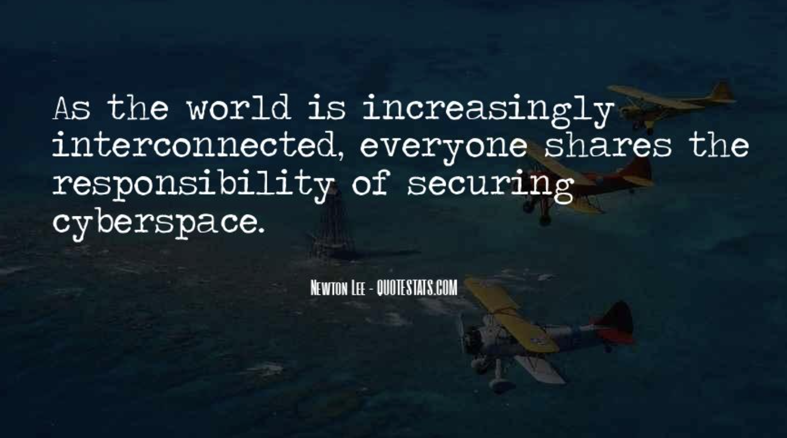

# Approach to Cyber Security Independence

## Avoid centralization of people

Too often few people have too many superpowers, this is dangerous. These people can sometimes unwillingly be the access point for hackers to enter the system. Of course, there are also cases where people themselves get paid lots of money to open doors for others or extorted. 

Use systems where deployment of a solution happens in a 100% deterministic way and where consensus between people and teams needs to be achieved. 

[Infrastructure as code](https://en.wikipedia.org/wiki/Infrastructure_as_code) is a good methodology to organize and your deployment, but also here in most systems few people have too much power, it's a good starting point and with some simple tricks such a system can be made more decentralized and consensus driven.

## Use open source software as much as possible.

Hire people who are fluent with open-source software, do everything in an open manner. If security is really important then make sure your team can read and validate the code used.

Often such code needs to be extended and integrated with a centralized blockchain based identity and authentication management system (see below).

Code needs to be built in house with experts and cross-building strategies can be done to make sure that no backdoors are inserted while building (compiling) the software, best would be to integrate this with “infrastructure as code” approach (see above).

PS: opensource software does not mean free, there is a cost involved in maintaining, improving such systems in line to requirements of a government or company. This can be an outsourced or internal approach. Very good knowledge is required to make such a strategy successful, and this is often an issue.

We suggest using software which is managed by people with knowledge, which often means paying a license fee, but demand the software is open source and understood by people under your control.

## Avoid complexity.

Complexity is the biggest evil for security. IT systems in general are extremely complex. The more layers the more it's difficult to see what is going on. Adding more layers to improve security has often the reverse effect. The most simple systems have the smallest hacking surface. Simplicity is your biggest friend in the security domain.

Many governments rely on commercial systems which are not open source nor simple, this forces the IT administrators to create a layered building block approach of often hundreds of different systems which need to work together. Each system adds to complexity, each system needs to be maintained, looked at from a security vulnerability perspective, upgraded, … This is often not done properly because administrators are afraid of the impact on uptime. Most will go for an approach as follows: if not broken, don’t touch, unfortunately in IT this is not doable, the more systems someone uses the more vulnerability issues inside (see risk of bugs & backdoors), today most systems need to be upgraded on a monthly basis. Now imagine what this does for 100 interconnected systems which all need to be individually updated and keep on working together, this is a nightmare to execute on.

## Use a blockchain based identity and authentication management system

Using a blockchain for managing identity and authentication.

A digital ledger is a good base to store information about users, groups and their access rights, proper “smart contracts” can be used to let the right people define security clearance levels and group access.

Don’t give the power of this to administrators, consensus needs to be implemented to allow management of groups & rights by itself. Consensus between required instances is a very important element to create a strongly identifiable and authenticated security access layer.

## Use Datacenters Carefully

Datacenters are and will be the first point of attack in a conflict situation, even countries like Ukraine only had 4-5 good datacenters which needed to be taken with disaster results. Next to physical violence Datacenters can be attacked over the network too or through insiders. Centralization is not a good strategy for securing your most valuable assets. 

While Datacenters are potentially required for certain high end compute requirements, they are for sure not needed for storage and alternative strategies can be created for most compute workloads as well.

If Datacenters are a must we would recommend to build small ones and have them spread over the country on at least 10 strategic locations and have good strategies in place to deal with data distribution (don't use replication, see below)

## Use Distributed Data Storage Systems, avoid Replication.

Also, centralized services are vulnerable, e.g. the best way to store data is using a quantum safe storage distribution system where not even a quantum computer can hack.Implement a new type of internet architecture, one which is much more decentralized.

Replication is a very bad approach, it leads to copying data to multiple locations leading to a bigger hacking surface! Please do not use replication in any of your data storage mechanisms.

There are storage systems today (some even as licensed opensource) which allow you to store data in such a way it can never be lost, stored over multiple locations, no data corruption can happen.

## Be ready for the future, consensus driven self healing approach.

Use the “human” element carefully. Self healing systems are becoming a possibility, it's only possible where simplicity was the rule. Self healing and automating complicated systems is too hard and vulnerable by itself.

Blockchain enabled consensus driven deployment techniques can help. This is a very novel approach, but highly recommended.

## Deploy Secure Private Sandboxes (ultra private areas)

Deploy secure apps inside sandboxes that have NO access to the internet, not in, not out. There are possibilities these days to avoid using internet protocols like http or tcp ip inside a secure environment. These are advanced techniques but super efficient to avoid hacking or vulnerabilities.

These sandboxes run compute and storage workloads, but cannot communicate with the internet.

People come in over secure application aware interfaces in such a way no harm can be done.

## Do not put all your eggs in the basket off big tech vendors

Most commercial software from big vendors is often not secure enough, even if it is claimed it is. It's too hard for you to really know if the software or system is secure. Of course often there is no choice and the system is required, then it's important to install this system in a sandbox (see above). 

Often the security device or software by itself has backdoors and “planted” vulnerabilities, this is hard to believe, but think about the logic behind this. What would you do as a smart government to have more insight, how to come inside another government or big company's network?

For years certain governments have been putting a lot of work into making sure there are backdoors in +- any system which is being sold from their country or related countries. Especially many (if not all) of the big cloud systems are open to their governments and black market access (dark web, which is heavily used by governments and non governments for getting access to anyone’s info as required). 

We do realize this might be hard to believe, because obviously this is not what these big companies will want us to believe.

## Idea, why not build an “internet infrastructure layer” co-owned by your citizens?

Technology is available these days to build out internet capacity which can be co-owned by the citizens. This allows us to build capacity faster and in a much more reliable way, invested by the citizens, secured by technology.

Think about it how solar panels can generate electricity for the people around, in a similar way compute & storage can be generated by citizens (business or personal) for people around.

This has proven to work very well, super reliable and also regenerative, it might allow much faster expansion and lower cost compared to traditional datacenter building methods.

## Keep all data in Secure Sandbox deployments

Secure locations need to be a mix between distributed and centralized facilities but in such a way that data can never be lost nor modified.

The apps can only access data inside the secure sandbox and use unique storage technology (zero-knowledge proof). No data goes to laptops or desktops.

Access is always done by means of a secure browser or other access technology and audited where required. Only the output of the screen is shown to people in their laptops.

As a principle

* No javascript applications running in browsers for secure government apps or data.
* All applications which need security are accessed using the secure remote access technology.
* On the network layer all data end2end encrypted with strong authentication.
* Data never leaves the sandbox and is dispersed and encrypted (multi layer) by design.
* All history of changes is kept with full audit trails.
* Blockchain technology is used to allow people with the right security clearance to see the audit trails when that would be required.
* Of course the secure sandbox needs to be secure and at least on 3 locations getting the data from distributed locations so that in case of disaster everyone can still continue.

